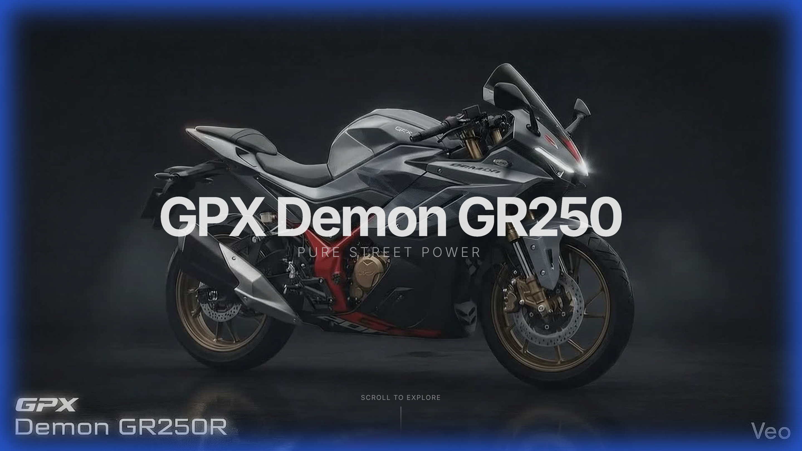

# GPX Demon GR250 | High-End Scrollytelling Experience

[](https://gpx-bike-co.vercel.app/)

A cinematic, interactive web experience designed for the **GPX Demon GR250**. This landing page leverages modern web technologies to create a high-performance scrollytelling narrative, featuring a scroll-synced image sequence that brings the motorcycle to life.



---

## ✨ Features

- **Interactive Canvas Sequence**: A smooth 40-frame image sequence that reacts precisely to your scroll position.
- **Cinematic Visuals**: Dark-themed aesthetic (#050505) with studio-grade lighting and minimalist typography.
- **Smooth Scrollytelling**: Powered by **Lenis** for buttery-smooth scrolling across all devices.
- **Reactive Headlines**: Dynamic text beats that appear and disappear based on the bike's assembly state.
- **Performance Optimized**: Preloaded image frames rendered on HTML5 Canvas for high FPS interaction.

## 🛠️ Tech Stack

- **Framework**: [Next.js 14](https://nextjs.org/) (App Router)
- **Animations**: [Framer Motion](https://www.framer.com/motion/)
- **Smooth Scroll**: [Lenis](https://github.com/darkroomengineering/lenis)
- **Styling**: [Tailwind CSS](https://tailwindcss.com/)
- **Canvas API**: For efficient frame-by-frame rendering.

## 🚀 Getting Started

To run this project locally, follow these steps:

1. **Clone the repository**:
   ```bash
   git clone https://github.com/sahidDev09/Gpx-bike-co.git
   cd Gpx-bike-co
   ```

2. **Install dependencies**:
   ```bash
   npm install
   ```

3. **Run the development server**:
   ```bash
   npm run dev
   ```

4. **Build for production**:
   ```bash
   npm run build
   npm start
   ```

## 📸 Preview

The experience starts with a full-view of the **GPX Demon GR250** and its "Pure Street Power" ethos. As you scroll, the bike sequence animates forward and backward, creating a tactile sense of depth and engineering precision.

---

Built with ❤️ for the GPX community.
